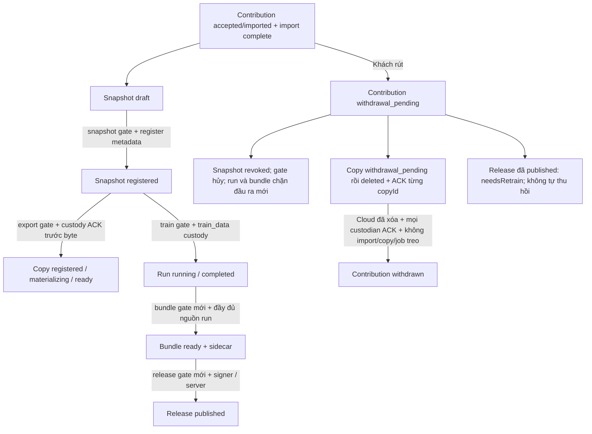

# P4 Phase A — contract snapshot và custody, 07/10/2026

> Cập nhật B–E ngày 07/10/2026: xem mục **P4 B–E** cuối tài liệu. Phần Phase A là lịch sử đã được duyệt.

**Contract đề nghị duyệt; chưa mở dataset/train Fleet.** Base SmartLabel
`1a382dbf79a90156d3b690e1d9fe09b54296d790`, Fleet
`dc12afe97c03e8ec3c97ee932b0f18ac350a62f4`. Hai nhánh
`feature/fleet-dataset-custody-20261007` giữ bản sửa chọn ảnh mới nhất.
Không thay checkout vận hành, project/nhãn/split thật, Hydro, intake hoặc model.

Pha A thêm parser thuần và bộ fixture chung; không đăng ký route, ghi DB,
ký JWT, tạo snapshot trên đĩa, copy ảnh hoặc mở một exporter mới.
`validate`/`assert_claims_match` chỉ kiểm cấu trúc/ràng buộc; **không cấp quyền**.
Chữ ký, trạng thái online, CAS dùng một lần và thu hồi là bắt buộc ở Pha B–D.

## 1. Authority và các trạng thái



| Đối tượng | Trạng thái bền vững / quy tắc |
|---|---|
| Contribution | Giữ enum hiện có. Chỉ accepted/imported, purpose=training, retention còn hạn, import complete và owner hợp lệ mới cấp gate. Unknown/pending/quarantined/rejected/withdrawal_pending/withdrawn đều khóa. |
| Snapshot | draft → registered; registered → revoked là một chiều. Snapshot immutable; sửa nhãn/split/project context tạo snapshot mới. Digest không tự chứng minh quyền hoặc chất lượng nguồn. |
| Copy | registering → registered → materializing → ready; mọi trạng thái có thể sang withdrawal_pending → deleted. Đăng ký dở cũng là nghĩa vụ xóa; timeout không coi như chưa ghi. |
| Gate/operation | issued → consumed hoặc revoked/expired. Một jti gắn một operationId và payload hash. Retry cùng intent chỉ trả receipt/status, không cấp phép thực thi lần thứ hai. |
| Run | planned → running → completed/failed/cancelled; source_revoked độc lập với kết quả train. Khi rút: dừng job, đóng reader, chặn output mới; không tuyên bố đã “untrain” checkpoint. |
| Bundle | preparing → ready hoặc blocked; sidecar gắn SHA ZIP và checkpoint. Bundle từ nguồn revoked không tạo candidate/release mới. |
| Release | Giữ state machine P2. Chỉ release đã commit published trước điểm thu hồi được giữ; needsRetrain=true, không tự rút model khỏi khách. Uploaded/candidate/chữ ký cũ chưa published đều phải kiểm quyền lại. |

## 2. Schema, định danh và byte

Schema máy đọc: `contracts/fleet-dataset-custody/schema.json`, JSON Schema
2020-12, `$defs` snapshot/check/custody/claims/tombstone/lineage. Mỗi object
allowlist, tất cả trường liệt kê bắt buộc; không có force/skip/trainAllowed.
Parser chỉ triển khai tập keyword dùng trong schema này, không là thư viện
JSON Schema tổng quát hoặc bộ phân giải `$ref` từ Internet.

Giới hạn đề nghị: body UTF-8 ≤65.536 byte; nesting ≤16; tối đa80 ảnh từ20
contribution/import mỗi snapshot. Không chia nhỏ lineage để vượt trần: run
có tập nguồn lớn hơn phải dừng báo giới hạn. Không âm thầm bỏ nguồn đã rút.
Snapshot/reference pairs phải sắp theo contributionId rồi assetId; mỗi
contribution đúng một importId. ImportId/reviewRevision là SHA-256 hiện hữu,
không đổi thành UUID. UUID lowercase v1–v5; hash lowercase64hex; không đường
dẫn, email, tọa độ, token hoặc tên tự do trong bản kê cloud.

`projectBinding = {workerId:UUID, storageId:UUID, projectId:project_*}`.
Receiver cấp storageId cho đúng root managed lần đầu dưới khóa project,
ghi registry bền trước ACK. Cùng projectId tại hai workspace không cùng
storageId; copy marker sang root khác không chuyển binding. Root/volume thật
chỉ trong registry Windows, không gửi lên Fleet. Kiểm lại ancestor/reparse
point sau await, từ chối symlink/junction, không chấp nhận absolute path từ
cloud. Khi project đi vào project_trash dùng binding cũ và đường trash đã
kiểm chứng như importer hiện có; vị trí khác cần quy trình chuyển riêng.

`FleetDatasetSnapshotV1` có projectBinding, projectContextSha256, items,
snapshotDigest. projectContextSha256 là SHA-256 **byte project.json đã lưu**,
giữ schema/crop/settings/split context không bị thay sau xác nhận. Ngoài ra
receiver kiểm split revision/locked-group evidence đầu/cuối trước đăng ký;
split file thay riêng cũng làm hủy intent, không chỉ so project.json.
Snapshot lưu dưới `project/fleet_datasets/` có `.fleet-storage-v1.json`;
không đặt marker ở root project làm chặn các ảnh legacy không liên quan.
Marker dùng schema FleetStorageV1 hiện có; binding nằm file riêng có registry
đối chiếu, không dùng sự tồn tại marker thay bằng chứng sở hữu thư mục.

Mỗi item đúng các trường:

```
contributionId, assetId, importId, imageSha256, pixelFingerprint,
reviewRevision, labelSha256, groupId, split, sourceKind
```

imageSha256 là hash byte ảnh thực; pixelFingerprint giữ thuật toán FleetRGBV1
hiện có (prefix + NUL + width/height uint32 BE + RGB decode). Review phải
approved/reviewed, có nhãn binary hợp lệ, qualification không blocker,
Hydro slot-only có bằng chứng Gateway/dataOwnership/rack/slot/crop đúng.
Không dùng toàn cảnh, nguồn chưa qualified hoặc nhãn AI tự đoán. customer_phone
hiện hữu ánh xạ tường minh sang phone_supplement, chỉ train. groupId là nhóm
**toàn vụ** theo namespace Gateway/dataOwnership/site/zone/cycle hiện có;
plantGroupId chi tiết không được thay groupId để tách cùng vụ vào nhiều tập.

Snapshot không nhân bản ảnh. Label payload riêng (metadata có thể xóa) lưu
đúng các nhãn đã chọn từ review tại revision đó; labelSha256 băm byte payload
đã đóng băng, receiver đối chiếu lại giá trị/schema với review, không tin hash
do client tự khai. ReviewRevision đổi thì tạo snapshot mới trước thao tác mới;
không ghi đè snapshot hoặc bắt sửa project cũ. Chặn trùng byte/pixel và nhóm
legacy holdout theo preflight hiện có; nhóm val/test đã khóa phải giữ nguyên,
không sửa split_assignment.json hoặc đưa record Fleet vào project.images.

Canonical profile dùng ở contract mới: JSON ASCII, object keys thứ tự mã
ASCII, separators `,`/`:`, không whitespace; array giữ thứ tự đã kiểm;
chỉ null/bool/số nguyên an toàn/chuỗi ASCII printable. Số nguyên dạng 1.0
hoặc 1e0 chuẩn hóa thành 1; NaN/Infinity/fraction bị từ chối. JSON trùng key,
kể cả key escape, bị chặn. Không đổi `contract_hash` của bundle Hydro/P2.

```
snapshotDigest = SHA256(canonical(items))
snapshotBindingDigest = SHA256(canonical([
  "FleetDatasetBindingV1", projectBinding, projectContextSha256, snapshotDigest]))
itemsDigest = SHA256(canonical(sorted unique [{contributionId, importId}]))
```

Digest danh sách không chứa binding nên gate **phải** chứa cả binding digest.
Không dùng riêng snapshotDigest để nhận quyền ở project khác. Kiểm lại byte
ảnh/nhãn/context trước dùng và trước commit output, không dùng cache QA.

## 3. Gate và transport

SmartLabel → `POST /smartlabel/lineage` ở receiver loopback hiện hữu;
Host/Origin exact, X-Fleet-Client=SmartLabel, không Sec-Fetch-Site/CORS,
Content-Type JSON và body ≤64KiB. Không mở port/service mới, không gọi Fleet
trực tiếp từ Python, không giữ worker credential trong SmartLabel.

Native envelope dự kiến: `{action, projectId, projectRoot, payload}`; action
allowlist register_snapshot/check/consume/custody/status. projectRoot chỉ tại
loopback, payload schema tương ứng, không nhận URL/shell/path output tự do.
Đăng ký snapshot gửi metadata ≤64KiB qua worker tới `lineage/snapshots` để
Fleet lưu membership; server chỉ nhận sau binding/import/source evidence đã
được receiver xác minh. Check/status không tự tạo snapshot hoặc copy.

Worker credential hiện có bảo vệ `/api/company/v2/receiver/lineage/*`.
Session admin/technician/support, cookie household hoặc vé xem ảnh không thay
worker auth. API lineage không phụ thuộc intake ON; rút/ACK luôn hoạt động
khi intake OFF. Hành động tạo snapshot vẫn tường minh trong SmartLabel.

| Endpoint (chưa nối route ở A) | Payload / response bắt buộc |
|---|---|
| POST lineage/check | FleetLineageCheckV1: operationId, operation, projectBinding, snapshotDigest, snapshotBindingDigest, subjectDigest, items. Server đối chiếu nguyên tập nguồn trong registry, không chỉ tập con client gửi. |
| 200 check | `{schemaVersion: FleetLineageCheckResultV1, operationId, items:[{contributionId,importId,state}], gateToken, gateTokenId, expiresInMs}`; chỉ có token nếu mọi item hợp lệ. Không partial token. |
| check từ chối | HTTP409 `{error:lineage_unavailable, operationId, items:[{contributionId,importId,state,reason}]}`; tuyệt đối không gateToken. Unknown state khóa thao tác. 401/403 đúng lỗi auth; 429/503/network là bận/offline, không chứng nhận thành công. |
| POST lineage/consume | `{operationId,gateToken,snapshotBindingDigest,subjectDigest}`; JWT verify + fresh source/owner/worker + CAS issued→consumed; trả receipt gắn cùng intent. Không có quyền dùng receipt cho operation khác. |
| POST lineage/custody | FleetDatasetCustodyV1 và JWT trong header X-Fleet-Lineage-Gate (redact). Kind export/train_data khớp pathClass managed_export/managed_train; inventoryDigest khóa whitelist file dự kiến ở receiver. |
| 200 custody | `{schemaVersion:FleetDatasetCustodyReceiptV1,operationId,copyId,state:registered,snapshotBindingDigest,inventoryDigest}` chỉ sau mọi participant đã đăng ký. Mất response: query status, không ghi byte dựa trên suy đoán. |
| POST lineage/copies/deleted | `{operationId,copyId,contributionId,tombstoneDigest}`; chỉ custodian đã đăng ký, nghĩa vụ xóa hiện có. Receipt idempotent không cấp quyền copy; copyId lạ/sai worker trả409. |
| POST lineage/status | `{operationId,projectBinding}`; chỉ đọc, trả not_found/pending/registered/consumed/complete/revoked theo durable journal. Không renew, issue, consume hay chạy tiếp từ polling. |

Các response trên cũng phải strict allowlist, bounded ≤64KiB và cùng scope
worker/project. Pha A mới có executable schema cho request/claims/local
artifacts; parser response/auth/route và test HTTP thuộc Pha B, không coi tài
liệu bảng này là bằng chứng endpoint đã chạy.

JWT đề nghị dùng RS256/khóa online Fleet hiện có, tách khỏi Ed25519 offline
ký model. Header cố định alg=RS256, typ=JWT; aud=fleet-dataset-v1, iss=Fleet
origin đã cấu hình. Claims FleetDatasetGateV1 gồm jti, iat/exp, operationId,
operation, projectBinding, hai snapshot digest, subjectDigest, itemsDigest.
TTL đề nghị300s, trần600s. Server kiểm iat≤now<exp, không leeway kéo dài;
client dùng expiresInMs trừ RTT bằng monotonic và kiểm lại khi resume/sleep.
JWT chỉ RAM và HTTPS/loopback, không ghi file/argv/log/run manifest. Run chỉ
lưu gateTokenId=jti; không có khóa ký hoặc token thật trong fixture Phase A.

subjectDigest khóa intent ngoài snapshot: snapshot dùng bindingDigest;
export/train băm kế hoạch job (dataset legacy/version + tùy chọn + output
registry ID); bundle/release băm run/checkpoint/ZIP/manifest identity. Quyền
cho một checkpoint không chuyển sang model khác dù dùng cùng snapshot.

| Thao tác | Gate và điều kiện |
|---|---|
| Tạo snapshot | snapshot, kiểm nguồn/review/holdout và đăng ký metadata trước ready |
| Export | export mới; custody registered trước byte đầu; final recheck trước ready |
| Train | train mới, train_data custody; job kiểm lại khi bắt đầu và lease renewal; không dùng export gate thay |
| Bundle/candidate | bundle mới trên đầy đủ nguồn run/checkpoint; recheck trước công bố ZIP/candidate |
| Ký và publish release | release mới cho từng operation/subject; signer và server publish không dùng receipt đã consume trước đó làm quyền mới |
| Xem metadata/status; rút/xóa/ACK | Không cần gate quyền dùng dữ liệu; auth riêng vẫn bắt buộc, không bị intake OFF chặn |
| Legacy không Fleet | Giữ nguyên đường cũ; parser mới không là cờ bypass fleet_boundaries |

## 4. Một lần, race, custody và phục hồi

**Thiết kế bắt buộc cho B:** chỉ có token JWT hợp lệ chưa đủ. Durable Mongo
journal giữ request hash, worker/binding, jti, trạng thái và participants.
CAS cùng operationId/body chỉ có một lần consume; cùng ID khác body409.
Replay sau consumed chỉ được xem receipt. Receiver có journal riêng giữ job
đã bắt đầu/completed/cancelled, không chạy lại side effect sau crash chỉ vì
server trả receipt cũ. Không in JWT trong audit; không dùng RAM làm authority.

Đăng ký copy: receiver lưu intent + inventory + vị trí managed trước, Fleet
đăng ký nghĩa vụ từng contribution, rồi ACK registered; sau đó mới tạo byte.
Một participant thất bại hoặc quyền bị rút giữ pending/aborted để cleanup,
không trả partial success. Copy chứa nhiều contribution bị rút một nguồn
thì xóa toàn bộ copy và revoke snapshot, không tái gán các file còn lại.

Điểm cần reviewer chốt trước B: Mongo Windows đang standalone. Không được
mặc nhiên dùng multi-document transaction hoặc `check → write` rời rạc rồi
gọi là atomic. Đề nghị một authority document có CAS cho mỗi binding trong
pilot, giới hạn metadata512KiB/80snapshot/128copy/200operation đang hoạt
động; đăng ký/gate/revoke của cùng binding serialize trên document đó.
Registry chi tiết ở document khác chỉ là participant/journal, không tự cấp
quyền. Withdrawal và mọi thay đổi dataOwnership phải fence authority trước
ACK; crash recovery không mở lại quyền trước đối soát. Nếu không chứng minh
được tương tác với route sở hữu hiện có, B phải giữ gate đóng và trình review
phương án khác; A **chưa kiểm chứng** thuật toán này hay CAS qua process.

Server kiểm ownerAccountId và dataOwnershipId hiện hành theo `currentOwner`;
không dùng email, không coi đổi ownerEpoch do remote pause là chủ mới. Gate
ghi fingerprint ownership hiện hành trong registry để recheck khi consume.
Nguồn thuộc chủ cũ luôn là chủ cũ, chủ mới không đọc/rút/xem lineage của họ;
source thiếu dataOwnership evidence không được nâng quyền bằng inference.

Receiver độc lập SmartLabel ghi tombstone **trước** xóa. Tombstone
FleetDatasetWithdrawalV2 có contributionId, binding, revocationRevision,
snapshotDigests/copyIds sắp duy nhất và revoked=true. Danh sách giới hạn
theo authority document; không cắt bớt khi vượt trần, không TTL/xóa tombstone
để “làm sạch”. Chặn cấp mới khi chạm giới hạn, giữ đường rút dữ liệu.

Xóa đúng whitelist ảnh/nhãn/manifest/temporary file đã đăng ký; link,
unexpected file, missing volume/project hoặc lỗi quyền giữ pending, không
ACK giả. Train reader phải dừng/đóng handle, thư mục export dở cũng phải
xóa và không báo thành công. Local tombstone + receiver registry + cloud
revocations đối chiếu trước mở/migrate/restore mọi vùng managed. Backup
thiếu ledger mới không đủ bằng chứng: quarantine/fail closed tới khi sync.
Tombstone vẫn dọn lại managed path bị restore kể cả app đóng.

withdrawn chỉ khi cloud deletion đã xác minh + tất cả company/import/copy
custodian ACK + không participant/job có thể ghi lại. Không reset cờ cloud
đã true. Bản sao thủ công ngoài registry hoặc ổ backup chưa mount không được
cam kết tìm/xóa; UI không nói đã xóa mọi bản sao ngoài hệ thống.

## 5. Lineage model và tương thích Hydro

FleetRunLineageV1 lưu snapshotDigest, snapshotBindingDigest, runId,
gateTokenId train, itemCount (số ảnh), contributionIdsDigest (danh sách ID
contribution unique/sorted), checkpointSetDigest. Registry giữ đầy đủ tập
nguồn; digest/count không đủ để lấy quyền nếu không còn membership.
Bundle giữ lineage trong sidecar **ngoài ZIP**, gắn thêm bundle ZIP SHA,
candidate SHA và gate bundle ID. Run/sidecar thiếu hoặc drift thì chặn;
không tự coi checkpoint mất lineage là legacy_only. Cần lineage union cho
fine-tune từ checkpoint có Fleet: toàn bộ nguồn tổ tiên, không chỉ batch mới.
Nếu vượt80ảnh/20nguồn giới hạn pilot thì chặn, không cắt ancestry.

ZIP Hydro cũ giữ byte/validator như hiện có. P2 và P3 hiện đều strict
`lineage.kind=legacy_only`; thêm sidecar **không** khiến Hydro nhận được
includes_fleet. A giữ guard đó và có regression kiểm chặn. Reviewer phải
duyệt contract phát hành version tiếp theo và giao riêng thay đổi verifier
Hydro trước khi mở delivery. P4 không sửa Hydro hoặc âm thầm nới V1.

Rút sau train: chặn mọi bundle/candidate/sign/publish mới từ run/ancestor
đó. Đã published trước rút: needsRetrain theo server, giữ model của khách
theo điều khoản; model đang chạy không tự đổi. Không dùng QA dataset hoặc
validated_holdout làm lời hứa đo được độ chính xác bệnh thực địa.

## 6. Threat model và giới hạn kiểm chứng

| Nguy cơ | Điều kiện phải bảo vệ / nghiệm thu B–D |
|---|---|
| Replay token hoặc retry sau mất ACK | JWT verify + Mongo CAS một lần + receiver job journal; same intent chỉ receipt, không chạy lại copy/train/sign |
| Sửa snapshot/nhãn sau gate | Băm lại item/context/byte, binding+subject token, immutable snapshot; abort output dở |
| Bỏ một contribution đã rút khỏi request | So đúng membership registry của snapshot/run/ancestor, không tin subset |
| Junction/đổi root/copy ngoài managed | Registry storageId/root, reparse/ancestor/whitelist mỗi checkpoint; không arbitrary recursive delete |
| App đóng/mất mạng/rút giữa export | Receiver chạy độc lập, tombstone trước purge, reader lease và stop job; chưa ACK còn pending |
| Restore backup cũ | Không mở dữ liệu trước sync ledger mới; revoked là một chiều, thiếu ledger không coi là chưa rút |
| Đổi chủ giữa snapshot/train | Fresh server owner/dataOwnership tại issue/consume/commit; fence authority; source cũ không thuộc chủ mới |
| Clock skew/sleep/offline dài | Server expiry; duration+monotonic client; hết mạng không gia hạn và không hoàn tất output |
| Ký bằng khóa đúng nhưng lineage thiếu | Signer/server vẫn kiểm gate và run ancestry; chữ ký không thay quyền dùng dữ liệu |
| Tăng trưởng metadata | Bounds trước allocation/registration, admission đóng khi đầy; purge/ACK vẫn chạy, không nâng gói trả phí |

## 7. Kiểm thử và bàn giao Phase A

45 vector tổng hợp chung, schema và manifest SHA-256 đồng byte ở hai repo.
Các test Node/Python đọc đúng vector, kiểm JSON strict, hash/canonicalization,
phone TRAIN-only, nhóm/holdout, duplicate, ownership binding gián tiếp qua
project worker/storage, scope/operation/subject/expiry và guard legacy.
Không có ảnh, khóa thật hoặc JWT sử dụng được trong vector.

Probe ở base với test mới thất bại vì **chưa có module contract** trong cả
hai repo; đây là bằng chứng tính năng chưa có, không phải tái hiện bug quyền
production. Sau thêm module: Node51/51, Python54/54. Full SmartLabel desktop đạt531/531 trong402,360s (0skip); lượt SSH trước
đó lỗi16assertion/3error GUI và2skip, được giữ log, không sửa test. Fleet
full và CI đúng SHA ghi trong bảng bàn giao; không suy từ targeted pass.
CI hiện dùng wildcard/discovery nên suite mới là bắt buộc, không skip/xfail.

Chưa kiểm ở A: API online, chữ ký JWT gate, CAS replay qua hai process,
copy/withdrawal race, xóa khi app đóng, restore, UI, train thật và thiết bị.
Những ca này là gate nghiệm thu B–D, không tuyên bố đã đạt bằng parser test.

Rollout/rollback A: chỉ nhánh source/test/docs, chưa nạp dịch vụ. Không có
migration/cấu hình/credential mới. B trở đi cần preflight/backup/runbook riêng;
không rollback về receiver không hiểu custody khi đã có managed copy.

Quyết định cần review: (Q1) giới hạn80ảnh/20nguồn và metadata pilot;
(Q2) invalidate snapshot khi revision nhãn/project/split đổi;
(Q3) authority/CAS trên Mongo standalone và fence thay chủ;
(Q4) phiên bản manifest/verifier Hydro trước phát hành includes_fleet.
Theo P4 A3, dừng tại đây để duyệt contract trước B–E.

Nguồn chính thức đối chiếu 07/10/2026: [Node24 crypto](https://nodejs.org/docs/latest-v24.x/api/crypto.html),
[Python3.10 JSON](https://docs.python.org/3.10/library/json.html),
[Mongo atomicity](https://www.mongodb.com/docs/manual/core/write-operations-atomicity/).
Giữ thư viện chuẩn, không thêm dependency hoặc đổi framework. Pha A không
dùng quota Blob/Atlas, thêm cron hoặc thay gói; giới hạn ở trên là trần ứng
dụng đề nghị, không là cam kết tài nguyên provider. Ràng buộc miễn phí cá
nhân/phi thương mại vẫn theo [Vercel Hobby](https://vercel.com/docs/plans/hobby);
không bật billing, paid trial, auto-upgrade hay overage.


### Sửa mô phỏng thao tác tab sau CI đầu

CI SmartLabel37576329665 tại4c0b608 lỗi duy nhất
`test_edit_defers_hidden_statistics_until_overview_is_opened` (P4 mới đạt).
Probe CTk độc lập: programmatic set(B)→set(A) nhanh không phát Map của A;
bấm hai nút tab thật phát đúng1Map. CTkTabview.set ẩn tab cũ sau100ms,
trong khi đường click ẩn ngay; test cũ dùng đường programmatic khác người dùng.
Test nay invoke nút GÁN NHÃN/DỰ ÁN thật và kiểm tab đã chọn. Giữ nguyên
assert_not_called, dirty=true, assert_called_once và dirty=false; không tăng
thời gian chờ, bỏ test hay đổi source sản phẩm. Probe/log đầu giữ trong audit.
Full/CI của bản sửa được ghi riêng trong bảng bàn giao, không dùng kết quả
CI lỗi ban đầu thay cho kết luận đạt.


## P4 B–E — triển khai sau duyệt contract, 07/10/2026

**[Có code] [qua test cô lập]; chưa nạp vận hành, chưa nghiệm thu ảnh khách hoặc train thật.**
Base B–E: Fleet `5b690f6a06d3d8226129ed20cc2577773c063f19`, SmartLabel
`20e45db119f89917bcca9acf651cf5c417f2dc1d`. Cùng nhánh
`feature/fleet-dataset-custody-20261007`. Chủ đã duyệt contract A và triển khai B–E.
Các mục Phase A phía trên là hồ sơ thiết kế/lịch sử; trạng thái runtime hiện hành là mục này.

### Authority và thay đổi so với đề xuất A

- API chỉ nhận worker credential. Phiên công ty/khách không thay credential worker.
  Snapshot phải tiêu thụ gate snapshot trước khi dùng export/train. Gate RS256 sống
  tối đa 300 giây, gắn operationId, worker/storage/project, đầy đủ nguồn, digest và
  subjectDigest. Replay chỉ trả receipt `fresh:false`; receiver không thực thi lại.
- **Một CAS Mongo chung `_id:pilot-v1`**, thay đề xuất chia ledger theo binding.
  Thu hồi một nguồn có thể ảnh hưởng nhiều binding; tất cả đăng ký, tiêu thụ,
  custody, đổi chủ và vô hiệu worker cần chung một thứ tự ghi. Chạy với Mongo
  standalone, không cần transaction/lock RAM/timer trong Function.
- Giới hạn pilot toàn ledger: 80 snapshot, 128 copy, 200 operation đang issued,
  2.000 operation lưu tổng, admission JSON 8 MiB. Trần này là giới hạn ứng dụng,
  không phải quota provider. Hết trần khóa thao tác mới; fence/ACK xóa vẫn xử lý.
  Overflow khi ghi fence đóng admission vĩnh viễn, giữ nghĩa vụ cleanup đã đăng ký.
  Chưa có thao tác UI để mở lại ledger; không xóa tombstone/ledger để lấy thêm quota.
- Gate đọc lại accepted/imported, purpose training, retention, import complete,
  custodian, manifest/receipt, current owner và dataOwnership. `ownerEpoch` đổi
  riêng do tạm ngưng truy cập không coi là đổi chủ. Ownership update/replacement/
  deletion qua FleetDevice được fence trước thay đổi; direct DB/bulk ngoài ứng dụng
  không nằm trong cam kết này. Không hướng dẫn vận hành ghi trực tiếp DB.
- Withdraw fence trước state transition; settlement đợi cloud deletion, ACK cũ,
  từng copy và từng snapshot binding. Model đã published có lineage liên quan
  được đánh dấu `needsRetrain`; không tự thu hồi model đã phát hành.

### Receiver, snapshot, bản sao và run

`receiver/src/datasetLineage.js`, `datasetSources.js`, `datasetTraining.js` sử dụng
cùng parser `backend/src/contributions/datasetContract.js`; đóng gói receiver phải
bao gồm module backend này, không chép riêng thư mục receiver ra ngoài cây repo.
Registry nằm ngoài project trong storage receiver. `fleet_datasets/` trong project
chứa marker/binding, snapshot tham chiếu, copies, runs, bundles và model-index.
Không đưa các vùng này vào Git. Restore toàn bộ cả registry và tombstone phải giữ
bằng chứng mới nhất; restore project đơn lẻ vẫn được đối chiếu với registry receiver.

Snapshot đóng băng project bytes, nhãn từng ảnh, review revision, split revision,
byte hash và pixel fingerprint. Nguồn Hydro phải qualified, slot-only, review hợp lệ.
Ảnh điện thoại chỉ TRAIN. Trùng byte/pixel với nguồn khác/Giàn bị chặn; nhóm holdout
không được đổi tập. Không ghi project.images hoặc split assignment legacy.

Mỗi export/train tạo một copyId mới: lưu intent local → Fleet custody → consume
một lần → chép file trong whitelist → kiểm lại quyền và ảnh → copy ready.
Thu hồi giữa chừng xóa output dở. Mất mạng không mở đường offline.
Native API giữ Host/Origin/X-Fleet-Client và cấm browser context, strict JSON 64 KiB.
Catalog chỉ đọc, phân trang 32 dòng mỗi loại; không tự copy/train khi mở cửa sổ.

Receiver độc lập SmartLabel xử lý tombstone, purges đúng inventory/marker, từ chối
junction/link/file ngoài whitelist. Chỉ ACK sau reader train đã thoát; PID còn sống
thì giữ withdrawal_pending. Bản sao khôi phục trong root đã đăng ký/project_trash
bị dọn lại theo tombstone. Không tìm/xóa bản người dùng tự chép ra ngoài vùng quản lý.

Train mới hỗ trợ classification, một thiết bị, không resume/DDP. TRAIN và VAL phải
đủ hai nhãn; không dùng TEST làm VAL hoặc tự tách ảnh. Có thể gộp ảnh **Giàn** đã
review theo split đã lưu; bộ **Bổ trợ riêng** chưa được hợp nhất trong luồng này.
Checkpoint cha phải có lineage đầy đủ; snapshot mới chứa mọi ảnh/import/hash tổ tiên.
Chưa có phép hợp nhất lineage khác binding vào bundle: các run bundle phải cùng snapshot.

Child worker bắt đầu sau lease online; watchdog gia hạn 20 giây, không kéo dài qua
hạn monotonic. Offline/revoke làm child tự thoát; parent chỉ hoàn tất sau child exit,
receiver kiểm lại quyền và ghi FleetRunLineageV1/hash checkpoint. Các callback, cache,
plots, workers và experiment tracker/sync được cấu hình để giữ dữ liệu trong vùng
managed. Cấu hình người dùng/ứng dụng khác không bị sửa. Chưa chạy epoch Ultralytics thật.
Model weights/runs vẫn chiếm đĩa local; trần copy ảnh không thay quota toàn bộ training
artifacts. Cần nghiệm thu dung lượng/hiệu năng trước pilot thật.

### UI, đối soát và gói model

SmartLabel có cửa sổ không modal **Snapshot dữ liệu khách** trong Dataset/Train:
chọn nguồn → xem trước nhóm/split → tạo snapshot → export/train tường minh.
Worker nền do app sở hữu; đóng view không mất khóa job/project; callback cũ không
thay lựa chọn mới. Dừng/đóng app đợi child đóng trước hoàn tất tác vụ.
Fleet inbox detail chỉ hiển thị số snapshot/model và cần train lại từ server;
missing → chưa có thông tin, không suy luận từ imported.

`client-pending.json` lưu exact ID/body trước dispatch snapshot/copy/bundle. Mất
phản hồi kể cả 2xx sai schema giữ pending qua mở lại app; không tạo lượt mới ngầm.
**Đối soát lượt trước** đọc journal receiver và authority online; chỉ retry cùng
ID/body theo bấm tường minh nếu chưa bắt đầu. Receipt không phải quyền train lại.
**Đóng lượt đã bị chặn / chưa bắt đầu** chỉ xóa intent client sau đối chiếu terminal
hoặc chưa bắt đầu; không xóa output, không đổi quyền. Unknown/interrupted registration
vẫn khóa; chưa có công cụ tự sửa journal dở. Run không tự resume; catalog giữ lịch sử.
Gói có kết quả final chưa rõ được giữ để đối soát, không rollback kết quả có thể đã
commit ở receiver. Không tuyên bố gói hoàn tất chỉ vì ZIP tồn tại.

Bundle chỉ chuẩn bị shadow tại máy. Gate kiểm toàn bộ run/ancestor trước conversion
và kiểm mới trên hash ZIP cuối. Label distribution lấy từ các bản sao TRAIN
đã được receiver xác nhận, không lấy nhầm số ảnh Giàn legacy; vẫn bắt buộc đủ hai nhãn. `FleetBundleLineageV1` ở sidecar ngoài ZIP; giữ format
Hydro cũ. Generic importer/export/version/train, converter, candidate vẫn chặn managed
paths, manifest và checkpoint/ZIP/ONNX có fingerprint đã biết trong workspace.
Chưa thể nhận dạng mọi artifact đã đổi byte hoặc tách hoàn toàn khỏi workspace.

**Candidate/sign/upload/offer `includes_fleet` vẫn đóng.** Parser release V1 tiếp tục
legacy_only, không mở cờ bypass. Phần chấp nhận manifest/verifier Hydro là tác vụ riêng
đã nêu khi duyệt A. Cờ needsRetrain hiện kiểm bằng release fixture có lineage server,
không phải bằng một release Fleet thật có ảnh khách.

### Kiểm thử, phạm vi và vận hành

Bộ P4 chạy Fleet API thật + MongoMemoryServer riêng + receiver thật + adapter Python
SmartLabel thật; ảnh tổng hợp và child train stub chỉ trong test. Bao gồm đăng ký/copy,
thu hồi khi Python đóng, backup restore, thu hồi lúc child còn đọc, lease dừng child,
chặn bundle mới, pending/receipt, đổi chủ, replay và CAS giữa nhiều process.
Bộ browser thêm detail lineage tại 1366/768/390, bàn phím và zoom thật 200%; ảnh fixture
ở `runtime/dataset-lineage-browser/`, không commit runtime. Full regression và CI từng
HEAD được ghi trong bảng bàn giao; pending/failed CI không được coi hoàn tất.

Không sửa Hydro, Nano/ESP, service, intake, production DB, provider quota hay key.
Không thêm dependency hoặc nâng framework. Không chạy train thật/ảnh thật, không tạo
accuracy claim; `validated_holdout` vẫn chỉ QA dataset. Không bật billing, resource trả phí hoặc auto-upgrade; không gọi Blob/Atlas
production trong test. CI dùng workflow hiện có, không đổi gói dịch vụ. Trần provider
đã có trong runbook triển khai vẫn là gate riêng, không suy ra từ quota local này.

Rollout dự kiến sau reviewer: chốt exact SHA hai repo, backup/restore rehearsal đúng
runbook, triển khai Fleet và receiver đồng bộ trước SmartLabel; nghiệm thu ảnh tổng hợp
với intake OFF, rồi mới đề nghị một pilot riêng. **Chưa chạy các bước rollout này.**
Rollback khi đã có custody: dừng lượt mới, dừng child, giữ receiver có khả năng cleanup,
đợi mọi nghĩa vụ xóa/đối soát; giữ registry/tombstone. Không hạ backend/receiver về bản
không biết custody khi còn copy. Không đổi DB hoặc xóa ledger để rollback.

Nguồn kỹ thuật chính thức, đối chiếu 07/10/2026:
[Mongo atomic single-document/CAS](https://www.mongodb.com/docs/manual/core/write-operations-atomicity/),
[Mongo BSON tối đa 16 MiB](https://www.mongodb.com/docs/manual/reference/limits/),
[Ultralytics train configuration](https://docs.ultralytics.com/usage/cfg/),
[Ultralytics settings](https://docs.ultralytics.com/usage/settings/),
[callbacks](https://docs.ultralytics.com/reference/utils/callbacks/base/),
[Python subprocess](https://docs.python.org/3.10/library/subprocess.html).
Đây là lý do chọn ledger có trần, tiến trình child riêng và settings riêng; không thay
bằng chứng nghiệm thu dữ liệu/model thật. Dừng sau E; AI_KL memory để reviewer cập nhật.

### Kết quả local SmartLabel B–E

Windows desktop Admin, Node 24 / Python 3.10, project tổng hợp:

| Bộ kiểm | Kết quả |
|---|---|
| Full `python -m unittest discover -s tests -v` cuối | 557/557, 405,740 giây, 0 skip |
| Client/lease/containment/pending | 15/15 |
| Managed bundle và giữ khóa candidate | 4/4 |
| Export Hydro legacy | 20/20 |
| UI snapshot | 7/7 trong full, gồm close/cancel/context/bounds |
| UI Fleet / backend / receiver trước pin cuối | 109/109, 242/242, 34/34 |
| Browser Fleet | 10 suite, zoom thật 200%, 390/768/1366, bàn phím |
| Lint, build isolation, build, audit production Fleet root/receiver | Đạt; audit 0/0 lỗ hổng |

Vòng full đầu có 555 test và 2 error ở bundle managed: writer cũ đếm ảnh Giàn,
không thấy nhãn snapshot. Sửa dữ liệu đầu vào private writer bằng counts từ
receiver, giữ kiểm đủ hai nhãn và test thiếu nhãn; full cuối đã đạt.
Fixture receiver đầu từng treo do tạo hai worker trong cùng DB của một test rồi
không đóng server khi setup lỗi; tách test/Mongo và thêm cleanup khi setup lỗi.
Không nới guard, skip test hoặc tăng timeout. Log các lượt được giữ ở audit
`D:/Fleet_Release_Audits/p4-dataset-runtime-20261007/`.
CI exact HEAD và pin Fleet cuối được ghi riêng trong bảng bàn giao, không suy từ local.


## Gộp Giàn + Fleet + Bổ trợ — 07/10/2026

Tác vụ `feature/fleet-mixed-supplements-20261007`, base Fleet `c6cf2f5`,
SmartLabel `d022c43`. Chủ đã duyệt bổ sung Bổ trợ và đợt backup/rollout/nghiệm
thu tổng hợp tiếp theo. Phát triển tại worktree riêng; không sửa workspace thật.

- Snapshot UI có lựa chọn **Gộp Bổ trợ đã bật và duyệt — chỉ TRAIN**, mặc định bật.
  Đổi lựa chọn xóa xác nhận và loại phản hồi xem trước cũ. Gộp Giàn vẫn là lựa chọn
  riêng khi export/train; Bổ trợ được cố định từ bước xác nhận snapshot.
- Receiver đọc trực tiếp manifest có sẵn, kiểm review, crop, training identity,
  ý nghĩa hiện diện/điều kiện, provenance/giấy phép và SHA. Quy tắc đối chiếu bằng
  cùng fixture với `training_supplements.validated_samples` Python; không thêm
  Python subprocess hoặc dependency cho receiver. Bản kê không bị sửa ngầm.
- Synthetic cần ảnh gốc Giàn đã duyệt, đúng SHA và nhóm TRAIN đã lưu; gốc VAL/TEST
  bị chặn. Cả ba nguồn được kiểm trùng byte và pixel, kể cả PNG mã hóa lại. Đường
  thoát thư mục/junction, thiếu nguồn, nhãn bị `train_exclude` đều chặn.
- Native preview V2 mang `includeSupplements`; V1 không tự thêm Bổ trợ. Client
  mới từ chối response thiếu lựa chọn/count; pending journal giữ nguyên lựa chọn
  qua restart/reconcile. Contract cloud và 45 vector P4-A không đổi.
- `FleetDatasetLocalContextV2` khóa SHA project, split, **nội dung ảnh Giàn**,
  manifest Bổ trợ, nhãn và ảnh Bổ trợ. Manifest nguyên văn lưu tại snapshot local;
  cloud chỉ nhận digest. Sửa ảnh/nhãn/nguồn/bật-tắt sau xác nhận phải tạo snapshot
  mới. Kiểm lại trước copy/train/gia hạn/bundle; không dựa mtime.
- Bổ trợ chỉ được chép vào TRAIN trong inventory managed có custody trước ghi
  byte. Khách rút nguồn khiến toàn bộ copy hỗn hợp bị dọn, kể cả sau phục hồi copy
  cũ; Giàn và Bổ trợ gốc không bị xóa. Run/bundle giữ lineage includes_fleet.
- Không tạo biến thể từ ảnh khách vào kho Bổ trợ riêng. Manifest/ảnh gốc có dấu
  nguồn Fleet bị chặn vì kho đó chưa có custody cho bản gốc phái sinh. Mọi dữ liệu
  Fleet tiếp tục đi qua kho managed; không được đổi cờ để đi đường train cũ.

### Kiểm chứng và giới hạn

Bài `dataset-supplements.test.js` chạy API, receiver, Mongo cô lập và Python thật:
3 nguồn, count/lớp/split, quyền thu hồi/xóa/phục hồi; 16 biến thể sai đối chiếu hai
validator; thiếu quyền lựa chọn, trường lạ, source/label drift, race, trùng pixel,
symlink và parent holdout. Regression thay byte Giàn sau snapshot: fail trên base,
pass sau sửa; log giữ trong audit `mixed-supplements-20261007`.
SmartLabel thêm kiểm lựa chọn Bổ trợ trong durable pending, response cũ/hỏng và
việc vô hiệu hóa xác nhận khi đổi lựa chọn trong lúc đang xử lý.

Giới hạn kế thừa P4: chỉ classification, một thiết bị, TRAIN/VAL đủ hai nhãn,
không resume/DDP; snapshot tối đa80 ảnh Fleet/20 nguồn; tổng export tối đa2000 ảnh.
Manifest Bổ trợ tối đa1MiB/2000 bản ghi, ảnh PNG/JPEG tối đa10MiB; unknown native
fields/JSON duplicate keys bị từ chối. TEST không dùng thay VAL. Snapshot cũ chưa
khóa ảnh local bị chặn khi context khác, cần tạo lại; không sửa ledger cũ để mở.
Gói có ảnh khách vẫn shadow tại máy; **chưa mở candidate/ký/upload/Hydro**.
Không coi một epoch ảnh tổng hợp là accuracy, nghiệm thu cây thật hoặc Nano.

### Phát hành được duyệt

Chỉ dùng commit đã push, CI đúng HEAD đạt và artifact đã băm. Backup DB Windows
qua CLI sẵn có, verify + restore riêng; bảo toàn receiver registry/tombstone và
workspace SmartLabel. Cloud không migration hoặc restore DB. Nạp Fleet backend
và receiver đồng bộ trước SmartLabel; giữ intake OFF, nghiệm thu trên ảnh tổng
hợp/DB cô lập ở CAOSANGPC. Dùng cửa sổ đóng bình thường của SmartLabel để lưu
công việc trước đổi source, không kill ứng dụng đang có nhãn chưa lưu.

Nếu đã có custody thật, dừng admission/child trước rollback, giữ receiver cleanup
đến khi các copy đã xóa/đối soát. Không quay về code không biết custody, xóa registry,
restore DB cũ hoặc làm sống lại dữ liệu đã rút. Trạng thái nạp thực, SHA/CI đầy đủ
và receipt backup/acceptance ghi trong bàn giao ngoài repo; mục này là contract
và quy trình, không tự coi rollout đã xong.

Nguồn chính thức đối chiếu07/10/2026: [staged production và promote không rebuild](https://vercel.com/docs/deployments/promoting-a-deployment),
[Vercel Hobby](https://vercel.com/docs/plans/hobby), [Cron Hobby](https://vercel.com/docs/cron-jobs/usage-and-pricing).
Giữ Hobby cá nhân/phi thương mại, giới hạn cron ngày một lần, không đổi plan,
billing, add-on, auto-upgrade hoặc cron hiện có; không thêm Blob upload trong nghiệm thu này.

Checkout Windows: thêm `.gitattributes` SmartLabel giữ nguyên byte bộ fixture P2.
Bốn candidate đã ghim bị CRLF của Git làm lệch SHA trên worktree mới; khôi phục
byte từ Git blob và giữ nguyên hash/validator. Bài vector hiện có tái hiện lỗi
trước sửa và đạt sau sửa; không đổi nội dung contract hoặc kỳ vọng bài test.

Kiểm local cuối đợt gộp: SmartLabel Windows **560/560, không skip**;
Fleet UI109, backend receiver regression và browser10 suite đạt trước bước pin cuối.
Các ca Bổ trợ riêng **8/8** đạt, gồm chặn admission trước8MiB sổ local và vẫn
xóa bản sao cũ khi thu hồi. Giữ log lần lỗi foreground zoom và CRLF; không nới test.
CI/rollout/nghiệm thu epoch thật xác nhận riêng bằng receipt đúng SHA trong bàn giao.
